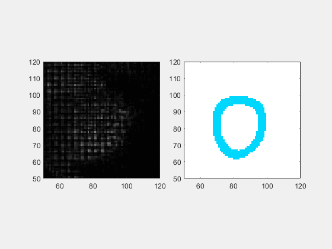
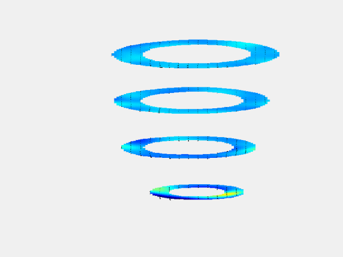

# HARP-I
HARP-I (Harmonic Phase Interpolation) is a method that utilizes radial basis function interpolation to recover tissue motion from 2D and 3D tagged MR images.

<p align="center">
  
  
</p>

## Installing unwrapping functionalities
HARP-I relies on the unwrapping algorithm implemented in the **DENSEanalysis** toolbox. However, any unwrapping procedure can be used. The unwrapping algorithm is available in the [DENSEanalysis repository](https://github.com/denseanalysis/denseanalysis/tree/main).

To install **DENSEanalysis** and access its unwrapping functionalities, follow these steps:

1. Clone the repository:
   ```sh
   git clone https://github.com/denseanalysis/denseanalysis.git
   ```
2. Navigate to the **DENSEanalysis** folder:
   ```sh
   cd denseanalysis/
   ```
3. Open **MATLAB** and run:
   ```matlab
   DENSEsetup
   ```

## HARP-I installation
To install **HARP-I**, follow these steps:

1. Clone the repository:
   ```sh
   git clone git@github.com:hmella/HARP-I.git
   ```
2. Navigate to the **HARP-I** folder:
   ```sh
   cd path/to/HARP-I
   ```
3. Open **MATLAB** and run:
   ```matlab
   HARPIsetup
   ```

### Graphical Installation Demonstration

For users who prefer a graphical interface instead of using the terminal, a step-by-step video tutorial is available here:

[**Watch the installation guide**](url_video)  

## Examples  
HARP-I includes demo scripts showcasing its application to **2D and 3D tagged MR images**. These can be found in the `examples/` folder.  

:file_folder: Inside this folder, you will also find a `README` file that provides additional explanations about the demo scripts and their usage.  

### Data Availability
Anonymized **2D and 3D tagged MR images** can be found in the `data/` directory.  

📢 **Note:** Due to size constraints, the data is hosted on an external cloud storage service. Please refer to the `README` within the `data/` folder for the download link.

## Citing

If you use **HARP-I** in your research, please cite the following publication:

:newspaper: *H. Mella et al., **HARP-I: A Harmonic Phase Interpolation Method for the Estimation of Motion From Tagged MR Images** in IEEE Transactions on Medical Imaging, vol. 40, no. 4, pp. 1240-1252, April 2021. doi: [10.1109/TMI.2021.3051092](https://ieeexplore.ieee.org/document/9320570).*

---

## Contact

For questions, feedback, or collaboration opportunities, feel free to reach out:

:mortar_board: **Hernán Mella**  
:round_pushpin: Pontificia Universidad Católica de Valparaíso  
✉️ [hernan.mella@pucv.cl](mailto:hernan.mella@pucv.cl)  

---

## License

This source code is licensed under the **Mozilla Public License, Version 2.0 (MPL-2.0)**. If a copy of the MPL was not distributed within this repository, you can obtain one at [http://mozilla.org/MPL/2.0/](http://mozilla.org/MPL/2.0/).