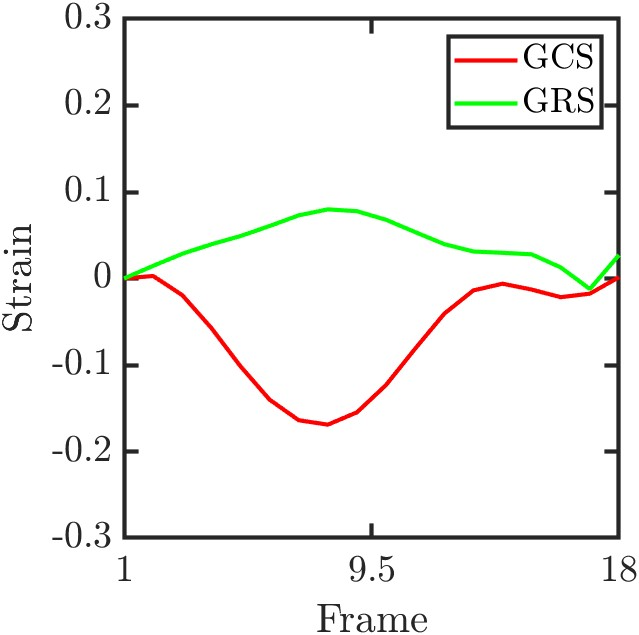
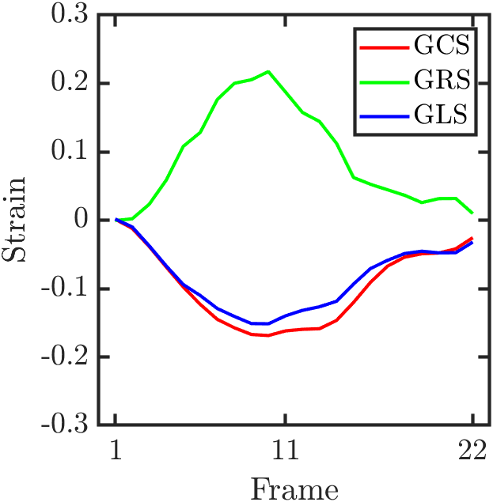

# Important Information
To view the results of each demo, ensure that all dependencies are installed correctly. Once installed, simply run the demo scripts.

---

## Motion estimation from 2D tagged images

The `demo2d.m` MATLAB script demonstrates the process of **2D cardiac motion and strain estimation** using HARP-I. The workflow consists of the following key steps:

### 1. Data Loading
- Loads a **2D tagged MRI dataset** (`data.mat`), which contains image data (`I`), a segmentation mask (`mask`), and relevant imaging parameters (`pixelsize`, `tagspacing`).
- Extracts the image size and the number of frames for further processing.

```matlab
load('data/data.mat')

% Image
I = data.image;

% Image size and number of frames
Isz = size(I);
Nfr = Isz(4);
```

### 2. Image Filtering:
- Computes the pixel size and encoding frequency based on tag spacing and pixel dimensions.
- Applies a harmonic filter (`HARPFilter`) to extract harmonic images (`If`) in specific directions (0° and 90°).

```matlab
pxsz = data.pixelsize/1000;
s    = data.tagspacing/1000;
ke   = 2*pi/s*pxsz;

% Create filter
direction = deg2rad([0 90]);
filter = HARPFilter(struct('Image',I,'CentralFreq',ke,'Direction',direction,...
                           'FilterType','Transmission','Butterworth_cuttoff',17,...
                           'Butterworth_order',10));

% Get harmonic image
If = filter.filter(I);
```

### 3. Motion Estimation:
- Estimates **2D displacement fields** using `HARPI`, leveraging **Cubic Multiquadric Radial Basis functions (RBFs)** with customized parameters for temporal fitting, smoothing, and interpolation.
- Outputs temporally-smoothed displacement fields `dxr` and `dyr`.

```matlab
tic
args = struct(...
        'Mask',                 mask,...
        'Frames',               1:Nfr,...
        'Show',                 false,...
        'Method',               'Multiquadric3',...
        'a_constant',            [1 1]*150/(s/pxsz(1)),... % equation (16) and (17) on the paper.
        'RBFFacDist',           'Linear',...
        'eta_constant',         15,... % equation (8) on the paper.
        'Connectivity',         4,...
        'RefPhaseSmoothing',    true,...
        'ROI',                  [86 132 68 114],...
        'TemporalFitting',      true,...
        'TemporalFittingOrder', 10);
harpi = HARPI(If, args);
t = toc;
dxr = squeeze(harpi.FittedMotion(:,:,1,:));
dyr = squeeze(harpi.FittedMotion(:,:,2,:));
```

### 4. Strain Estimation:
- Computes **radial (RR) and circumferential (CC) strain tensors** using the `pixelstrain` function.
- Maps the calculated strain values to the segmented regions of interest (`mask`) for visualization.

```matlab
[X, Y] = meshgrid(1:size(dxr,2), 1:size(dxr,1));
options = struct(...
    'X', X,...
    'Y', Y,...
    'mask',mask(:,:,1),...
    'times',1:Nfr,...
    'dx', dxr,...
    'dy', dyr,...
    'Origin', [],...
    'Orientation', []);
st = pixelstrain(options);
RR = NaN([Isz(1) Isz(2) Nfr]);
CC = NaN([Isz(1) Isz(2) Nfr]);
RR(repmat(st.maskimage,[1 1 Nfr])) = st.p1(:);
CC(repmat(st.maskimage,[1 1 Nfr])) = st.p2(:);
```

### 5. Segment-Wise Strain Analysis:
- Divides the cardiac region into six segments.
- Computes **mean and standard deviation of strain values** for each segment across frames using `getStrainBySegments`.
- Visualizes **segment-wise strain evolution over time** for both radial and circumferential components.

```
% Number of segments
Nseg = 6;

% HARPI
api = struct(...
    'CC',               CC,...
    'RR',               RR,...
    'Mask',             st.maskimage,...
    'Nseg',             Nseg,...
    'ClockWise',        false,...
    'Frames',           1:Nfr);
harpi_seg = getStrainBySegments(api);
```

### 6. Results Visualization
The video below shows the **estimated motion field** and the **circumferential strain map** computed using **HARP-I**. These results **may vary depending on the RBF** used.

<p align="center">
  
</p>

To visualize the **strain curves** (circumferential strain **CC** and radial strain **RR**) from the **2D demo**, run the following MATLAB script:

```matlab
strain_curves2D
```

<p align="center">
  
</p>


## 7. Modifying the RBF in HARP-I
HARP-I allows you to modify the **RBF** to suit your needs.  To change the RBF, refer to the **RBF Section** at the end of this file for details on available functions and their respective parameters.

---

## Motion estimation from 3D tagged images

The `demo3d.m` MATLAB script demonstrates the process of **3D cardiac motion and strain estimation** using **HARP-I**. The workflow includes the following key steps:

### 1. Data Loading
- Loads **3D tagged MRI image data** (`I`), segmentation masks (`mask`), and imaging parameters (`info`).
- Reorders taglines in the images for **consistent orientation** and **visualizes the tagged images** for qualitative assessment.

```matlab
path = 'data/data_3D/';
load([path,'data_for_processing.mat'], 'I', 'mask', 'info')

% Image size
Isz  = size(I,1:3);
Nenc = size(I,4);
Nfr  = size(I,5);

% Reorder dimensions for correct tagline orientation (x, y, z directions)
Itmp = I;
I(:,:,:,1,:) = Itmp(:,:,:,3,:);
I(:,:,:,2,:) = Itmp(:,:,:,1,:);
I(:,:,:,3,:) = Itmp(:,:,:,2,:);
clear Itmp
```

### 2. Image Filtering
- Applies a **3D harmonic filter** (`HARPFilter3D`) to extract harmonic images (`Ih`).

```matlab
spacing = info.TagSpacing;
vxsz    = [info.PixelSpacing' info.PixelSpacing(1)];
ke      = 2*pi./spacing;

% Define filter parameters
wave_vecs = 2*(spacing/vxsz(1))*[1,0,0;
                                 0,1,0;
                                 0,0,1];
filter = HARPFilter3D(struct('Image',I, 'WaveVec',wave_vecs, 'SinMod',false,...
                            'FilterType','Butterworth', 'Gabor_lambda',2,...
                            'Butterworth_order',5));

% Apply filter
Ih = filter.filter(I);
```

### **3. Motion Estimation**
- Estimates **3D displacement fields** using `HARPI`, leveraging **Cubic Multiquadric Radial Basis functions (RBFs)** with customized parameters for temporal fitting, smoothing, and interpolation.
- Outputs temporally-smoothed (if `TemporalFitting` is `true`) displacement fields stored in `harpi.FittedMotion`.

```matlab
tic
args = struct(...
        'Mask',             mask,...
        'Frames',           1:Nfr,...
        'Show',             false,...
        'Method',           'Multiquadric3',...
        'a_constant',       [1 1]*150/(spacing/vxsz(1)),... % Equation (16) and (17) in the paper.
        'RBFFacDist',       'Linear',...
        'eta_constant',     15,... % Equation (8) in the paper.
        'Connectivity',     4,...
        'RefPhaseSmoothing',false,...
        'ROI',              [50 120 50 120],...
        'TemporalFitting',  false,...
        'TemporalFittingOrder', 10,...
        'DownsamplingFac',  4);
harpi = HARPI_3D(Ih, args);
t = toc;
fprintf('\n Elapsed time HARPI: %d (s)', t)

% Compute motion magnitude
mag = sqrt(squeeze(harpi.RawMotion(:,:,:,1,:)).^2 + ...
           squeeze(harpi.RawMotion(:,:,:,2,:)).^2 + ...
           squeeze(harpi.RawMotion(:,:,:,3,:)).^2);
```

### 4. Strain Estimation
- Computes **radial (RR), circumferential (CC), and longitudinal (LL) strain tensors**.
- Uses **3D displacement fields** and **segmentation masks** through the `pixelstrain3D` function.
- Stores **strain tensors in 3D arrays** for visualization and analysis.

```matlab
[X,Y,Z] = meshgrid(1:Isz(2),1:Isz(1),1:Isz(3));
options = struct(...
    'X', X,...
    'Y', Y,...
    'Z', Z,...
    'mask',mask(:,:,:,1),...
    'times',1:Nfr,...
    'dx', squeeze(harpi.RawMotion(:,:,:,1,:)),...
    'dy', squeeze(harpi.RawMotion(:,:,:,2,:)),...
    'dz', squeeze(harpi.RawMotion(:,:,:,3,:)),...
    'Origin', [],...
    'Orientation', []);
st = pixelstrain3D(options);

% Initialize strain arrays
RR = NaN([Isz Nfr]);
CC = NaN([Isz Nfr]);
LL = NaN([Isz Nfr]);

% Assign calculated strain tensors
RR(repmat(st.maskimage,[1 1 1 Nfr])) = st.RR(:);
CC(repmat(st.maskimage,[1 1 1 Nfr])) = st.CC(:);
LL(repmat(st.maskimage,[1 1 1 Nfr])) = st.LL(:);
```

## 5. Results visualization
The video below shows the **estimated motion field** and the **circumferential strain map** computed using **HARP-I**. These results **may vary depending on the RBF** used.

<p align="center">
  
</p>

To visualize the **strain curves** (circumferential **CC**, radial **RR**, and longitudinal **LL**) from the **3D demo**, run the following MATLAB script:

```matlab
strain_curves3D
```

<p align="center">
  
</p>


## 7. Modifying the RBF in HARP-I
HARP-I allows you to modify the **RBF** to suit your needs.  To change the RBF, refer to the **RBF Section** at the end of this file for details on available functions and their respective parameters.

## List of available RBF in HARP-I

This section refers to equation 8 of the paper, where the following formula is presented along with its parameters:

$`(\Psi + \eta \mathbf{I}) \lambda = \mathbf{G}`$

Where:
- $`\Psi`$ : radial basis function
- $`\eta$`$ : regularization constant
- $`\mathbf{I}`$ : identity matrix
- $`\lambda`$ : vector of weight
- $`\mathbf{G}`$ : vector of measurement


First will see the respective associated equation, below this see the suggested values ​​(but if they are not exact, others close to this range should be tested)

The following RBF choices are available in HARP-I

- **Gaussian:**
  - $`\psi(r) = e^{-\left(\frac{r}{a}\right)^2}`$
  - Naming: ```Gaussian``` 
  - ```a_constant = [1 1]*140/(s/pxsz(1))```
  - ```eta_constant = 2e-3```

- **Inverse multiquadric**:
  - $`\psi(r) = \frac{1}{\sqrt{1 + (a \cdot r)^2}}`$
  - Naming: ```imqx``` 
  - ```a_constant = [1 1]*0.2/(s/pxsz(1))```
  - ```eta_constant = 1e-4```

<!-- - **Linear**: 
  - $`\psi(r) = \frac{r}{a}`$
  - ```a_constant = [1 1]*100/(s/pxsz(1))```
  - ```eta_constant = 4``` -->
<!-- 
- **Multiquadric**:
  - $`\psi(r) = \left(r^2 + a^2\right)^{1/2}`$
  - Naming: ```Multiquadric``` 
  - ```a_constant = [1 1]*100/(s/pxsz(1))```
  - ```eta_constant = 4``` -->
  
- **Cubic multiquadric**: 
  - $`\psi(r) = \left(r^2 + a^2\right)^{3/2}`$
  - Naming: ```Multiquadric3``` 
  - ```a_constant = [1 1]*150/(s/pxsz(1))```
  - ```eta_constant = 15```
 
- **Thin plate**: 
  - $`\psi(r) = r^2 \cdot \log(r)`$
  - Naming: ```ThinPlate``` 
  - ```a_constant = NaN```
  - ```eta_constant = 45```
  
<!-- - **Wendland C0**: 
  - $`\psi(r) = \left(1 - \frac{r}{a}\right)^2`$
  - Naming: ```WendlandC0``` 
  - ```a_constant = [1 1]*100/(s/pxsz(1))```
  - ```eta_constant = 4``` -->
  
- **Wendland C2**: 
  - $`\psi(r) = \left(1 - \frac{r}{a}\right)^4 \cdot \left(4 \frac{r}{a} + 1\right)`$
  - Naming: ```WendlandC2``` 
  - ```a_constant = [1 1]*900/(s/pxsz(1))```
  - ```eta_constant = 5e-3```
  
- **Wendland C4**: 
  - $`\psi(r) = \left(1 - \frac{r}{a}\right)^6 \cdot \left(35 \left(\frac{r}{a}\right)^2 + 18 \left(\frac{r}{a}\right) + 3\right)`$
  - Naming: ```WendlandC4``` 
  - ```a_constant = [1 1]*600/(s/pxsz(1))```
  - ```eta_constant = 1e-2```
  
<!-- - **Wu C0**: 
  - $`\psi(r) = \left(1 - \frac{r}{a}\right)^4 \left(16 + 29 \frac{r}{a} + 20 \left(\frac{r}{a}\right)^2 + 5 \left(\frac{r}{a}\right)^3\right)`$
  - Naming: ```WuC0``` 
  - ```a_constant = [1 1]*100/(s/pxsz(1))```
  - ```eta_constant = 4``` -->
  
- **Wu C2**: 
  - $`\psi(r) = \left(1 - \frac{r}{a}\right)^5 \cdot \left(8 + 40 \frac{r}{a} + 48 \left(\frac{r}{a}\right)^2 + 25 \left(\frac{r}{a}\right)^3 + 5 \left(\frac{r}{a}\right)^4\right)`$
  - Naming: ```WuC2``` 
  - ```a_constant = [1 1]*1200/(s/pxsz(1))```
  - ```eta_constant = 1e-2```
  
- **Wu C4**: 
  - $`\psi(r) = \left(1 - \frac{r}{a}\right)^6 \cdot \left(6 + 36 \frac{r}{a} + 82 \left(\frac{r}{a}\right)^2 + 72 \left(\frac{r}{a}\right)^3 + 30 \left(\frac{r}{a}\right)^4 + 5 \left(\frac{r}{a}\right)^5\right)`$
  - Naming: ```WuC4``` 
  - ```a_constant = [1 1]*600/(s/pxsz(1))```
  - ```eta_constant = 1e-2```
